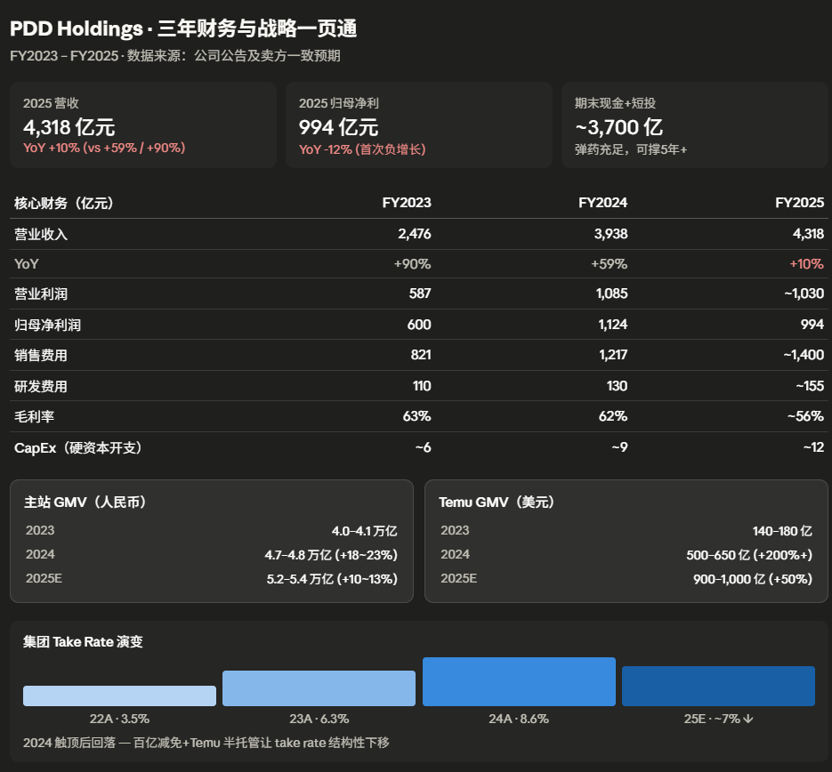

# PDD




```
上一轮投入 · 百亿补贴
2019.6 – 2021.6 ｜ 约24个月
钱给消费者（补差价）
费用↑↑ → 收入↑ 利润↓
拐点：21Q2 单季扭亏
之后增速：21年+58%、22年+39%、23年+90%
```

```
本轮投入 · Temu+百亿减免
2022.9 至今 ｜ 已超 30 个月
钱给商家+海外营销（让利+补贴）
Take rate↓ → 收入↓ 利润↓↓
拐点：未到，预计 2026H2–2027
2025 增速塌方至 +10%
```


为什么本轮投入会让营收下降

收入 = GMV × Take rate。上一轮补贴走费用科目，收入照涨；本轮"百亿减免/千亿扶持"是直接不向商家收技术服务费、佣金、保证金，相当于把 take rate 从 8.6% 砍到约 7%——少收的钱根本没进收入表。叠加国内 GMV 增速从 30%+ → 10%、Temu 全托管转半托管单位 GMV 收入贡献再降 30–40%，收入端直接塌方。


资本投向（费用化为主，硬 CapEx 极轻）

· 百亿减免/千亿扶持：3年1,000亿，让利商家

· 农业供应链+"电商西进"物流补贴

· 仅退款运费险全平台承担

· Temu 海外营销+履约+合规

· 研发：2025 同比 +19%，AI/半托管系统

· 硬 CapEx 仅~12亿元，不到营收 0.3%


# 如何研究电商平台的基本面

研究电商平台和研究传统零售/科技公司有本质不同：它是"双边/多边市场"，需要同时看用户、商家、交易、平台经济，再叠加一层财务和估值。下面是一个系统化的研究框架。


## 跟踪平台核心运营指标（最重要的部分）

财务数据是滞后指标，运营指标是先行指标。一个电商分析师 70% 的时间应该花在这里。

### 1. 用户侧（Demand Side）

- MAU / DAU（月活/日活用户）：增长是否还在加速？拐点何时出现？
- 年活跃买家数（Annual Active Buyers）：这是电商最关键的存量指标
- DAU/MAU 比率：衡量用户粘性，>30% 算优秀
- 新增用户 vs 流失用户：净增曲线
- 用户结构：一二线 vs 下沉、男 vs 女、年龄分布
- 用户获取成本 (CAC)：销售费用 ÷ 新增用户
- 用户生命周期价值 (LTV)：每用户终身贡献利润
- LTV/CAC：>3 才算健康

### 2. 商家侧（Supply Side）

- 活跃商家数：是否还在扩张
- 品类丰富度：SKU 总数、品类覆盖
- 品牌商家占比：决定客单价和毛利率上限
- 商家留存率：商家是否在流失
- 白牌 vs 品牌比例：拼多多以白牌为主，天猫以品牌为主，估值逻辑不同

### 3. 交易侧（Transaction）

- GMV (Gross Merchandise Value)：成交总额，是平台规模最重要的指标
- GMV 增速：同比、环比、剔除币种影响
- 订单量 / 客单价 (AOV)：增长靠"量"还是"价"
- 复购率 / 购买频次：粘性的最直接证据
- 货币化率 (Take Rate / Monetization Rate) = 收入 ÷ GMV
  - Marketplace 平台一般 3–8%
  - 自营模式不适用
  - 这是最关键的盈利杠杆，0.5pp 的提升就能显著影响利润

